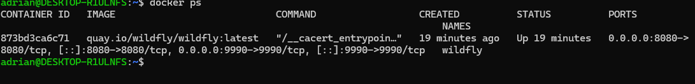
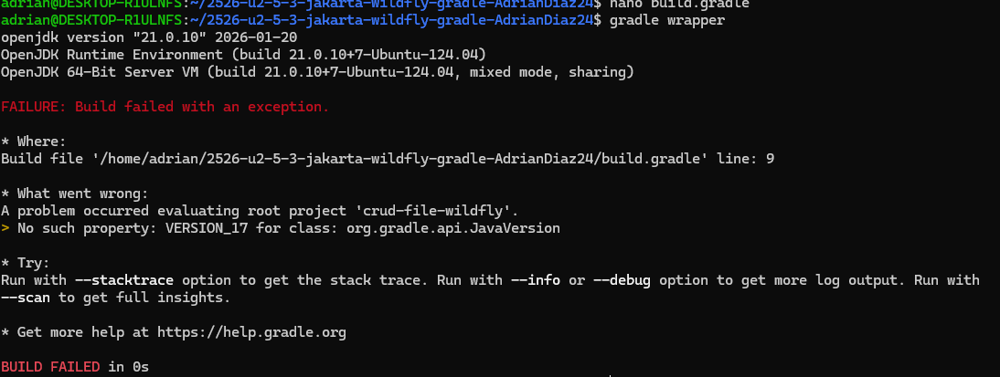

a) Componentes y funcionamiento de los servicios del servidor

1. Contenedor Docker: Es el entorno que contiendo todo SO y dependencias necesarias para usar todo
2. WildFly: Es el contenedor de aplicaciones
3. Aplicación WAR: Es el archivo compilado que tiene la logica de negocio y todo lo que viene a ser el proyecto
4. Puertos 8080/9990: Son los puertos por los cuales se comunican con http y WildFly

Flujo de una petición:

1. El cliente pide una peticion
2. Docker recive la peticion
3. WildFly pilla la peticion y analiza la URL para mandarla a la aplicacion
4. Por ultimo llega al endpoint y la aplicacion procesa la peticion y devuelve lo pedido



Al intentar ejecutar el gradle daba error, vi que hice lo mismo que mi compañero y intente buscar alguna solucion pero no conseguir solucionarlo, este error me daba tanto en clase como en el ordenador de mi casa, algo relacionado con la version del jdk 17, asi que al no poder realizarlo por este error he intentando enternder como funcionaba e intentar responder las preguntas


b) Archivos principales de configuración y bibliotecas compartidas

1. Ubicacion: /opt/jboss/wildfly/standalone/configuration/standalone.xml
2. Ajustes posibles: Datasources, logs, seguridad, y las IPs pueden conectarse.

c) Cooperación con el servidor web (proxy / reverse proxy) y https

```
server {
    listen 80;
    server_name miweb.com;

    location /api/ {
        # Redirige el tráfico al contenedor de wildfly puerto 8080
        proxy_pass http://wildfly:8080/;
        proxy_set_header Host $host;
    }
    
    # Bloqueamos el acceso a la consola de administración desde fuera
    location /console {
        deny all;
    }
}
```

El puerto 8080 y 9990 de WildFly no se publicarían en Docker hacia el exterior. Solo Nginx expondría los puertos 80 y 443.

d) Mecanismos de seguridad del servidor de aplicaciones

e) Componentes web del servidor de aplicaciones

f) Parámetros necesarios para el despliegue

g) Pruebas de funcionamiento y rendimiento

h) Documentación de administración y recomendaciones

i) Virtualización, nube o contenedores en el despliegue
